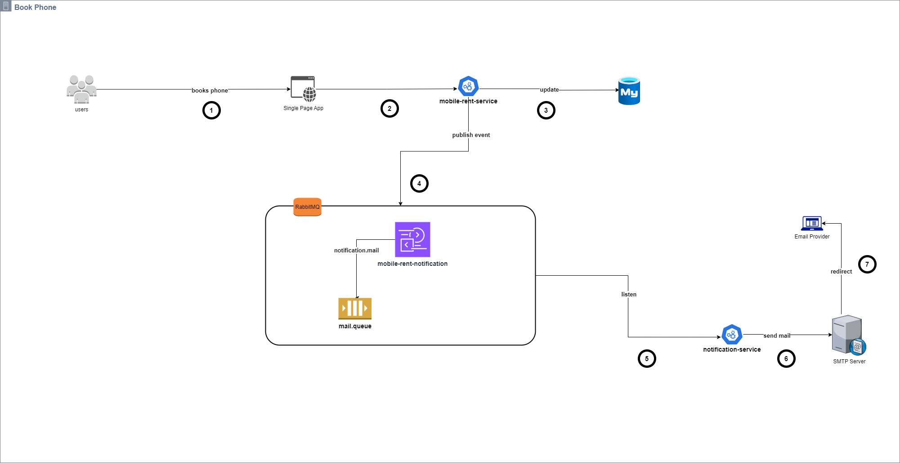
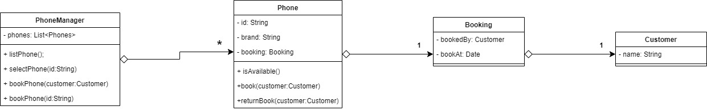

# Mobile Rent Infrastructure

## Description

The app allows user to view all the phones, and book a phones that are available. The app will send a notification to
the
user that the phone is booked successfully together with a link to return the phone he booked.

## Setup

Pre-requisites:

- Java version 21(Azul-zulu)
- Docker

1. Clone the repository

```shell
git@github.com:rshtishi/mobile-rent-infrastructure.git
```

2. Go to the project directory

```shell
cd mobile-rent-infrastructure
```

3. Build the project with the following command

```shell
# For Unix
./mvnw  install

#For Windows
mvnw.cmd  install

```

4. Run the following docker compose command

```shell
docker-compose up
```

5. While waiting the docker compose to finish, go to the browser and paste the following
   url: https://mailtrap.io/signin, and login with the following credentials:

```shell
account mailtrap.io: bt-test-x@proton.me
password: 12345678
```

6. Go to the `Inboxes->My Inbox` and you will see the email that was sent by the app.
7. Create a new tab and paste the following url: http://localhost:4200/home
8. You will see the home page of the app. You can view the phones and book a phone that is available.

## Technologies

- Angular for developing the web app
- Spring Boot for developing the mobile rent service and the notification service
- Docker for containerizing the app
- Mysql for the database
- RabbitMQ for the messaging service between services

## Architecture

We have the web app that is used by user all over the worlds that includes the following services:

- Mobile Rent Service: This service is responsible for managing the phones and the bookings. It exposes a REST API that
  is used by the web app to view the phones and book a phone.
- Notification Service: This service is responsible for sending the email to the user that the phone is booked
  successfully. It listens to the RabbitMQ queue and sends the email.
- RabbitMQ: This is the messaging service that is used by the Mobile Rent Service to send a message to the Notification
  Service that the phone is booked successfully.
- Mysql: This is the database that is used by the Mobile Rent Service to store the phones and the bookings.
- Web App: This is the web app that is used by the user to view the phones and book a phone.

We have also the Mobile Rent CLI that is developed to run in single machine and is used to manage the phones and the
bookings.



## Mobile Rent CLI

The app provides a CLI that is used to manage the phones and the bookings. The CLI provides the following commands:

1. Display available phones
2. Book a phone
3. Return a phone
4. Exit

### Test  CLI:

- Execute the following command to test the CLI

```shell
 docker exec -it mobile-rent-cli /bin/bash
```

- Run the java application with the command below:

```shell
java -jar /app/mobile-rent-cli.jar
```

#### Class Diagram:



## Reflections

- What aspect of this exercise did you find most interesting?
    - I found the most interesting part of the exercise the freedom to choose the technologies that I wanted to use to
      implement the app
      and the requirement left to me room to decide how to implement the app.

- What did you find most cumbersome?
    - The most cumbersome part of the exercise writing the instructions on how to setup the app and the technologies
      that I used to implement the app. 